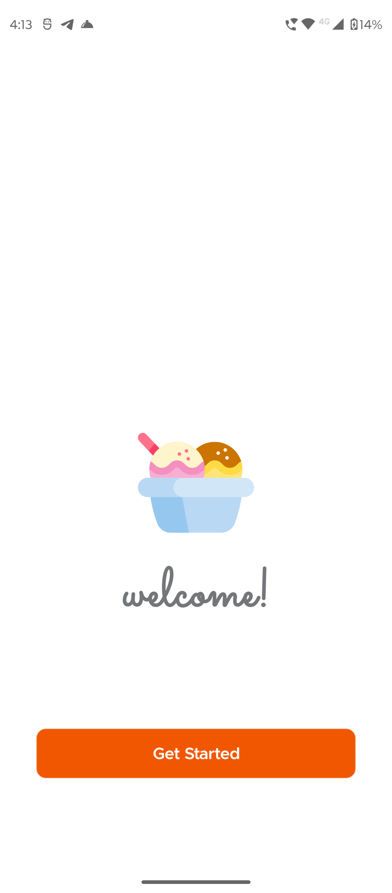
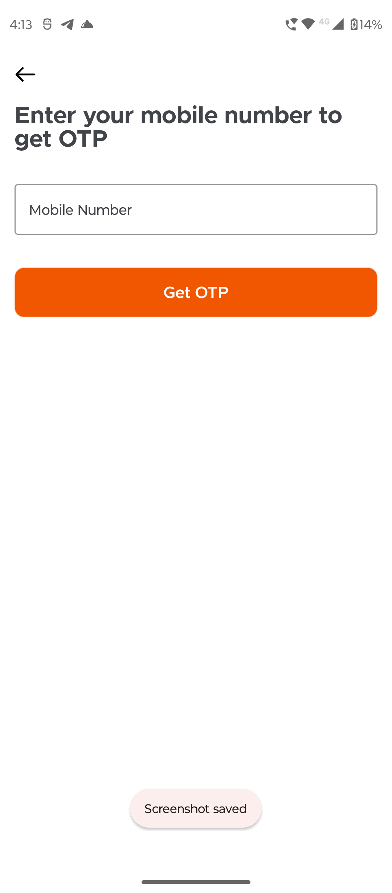
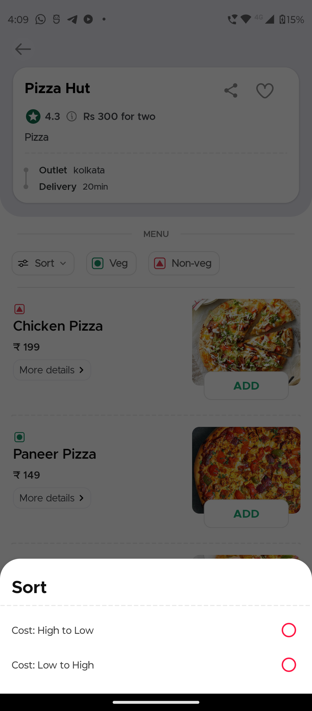
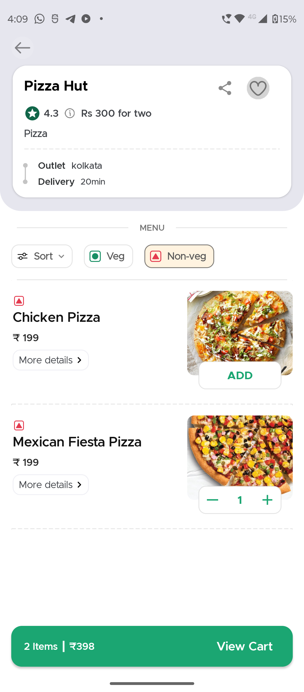
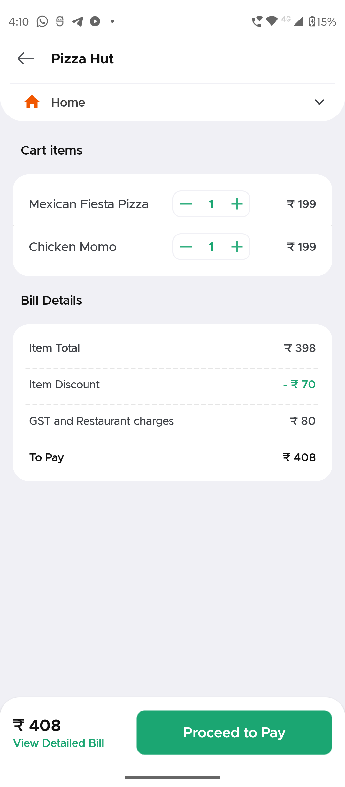

<h1 align="center">EATSY - Food Delivery App</h1>

<p align="center">
  
</p>

<p align="center">
  <a href="https://play.google.com/store/apps/your-app-link"></a>
</p>

## Overview

EATSY is a feature-rich food delivery application that allows you to order delicious meals from your favorite restaurants. With a user-friendly interface and cutting-edge technologies, EATSY enhances your food ordering and delivery experience.

## Features

- 🍔 Order food from a variety of restaurants
- 📦 Real-time order tracking
- 💳 Secure payment gateway
- 📜 View order history
- 🔐 Firebase Authentication for account security

## Technologies Used

- 
- 
- 
- 
- 
- 
- 
- 
- 
- 

## Screenshots

<!-- Add screenshots or GIFs of your app in action -->
<p align="center">
  
  
  
  
  
  
  
  
  
  
  
  
  
  
  
</p>

## Getting Started

1. Clone the repository
   ```sh
   git clone https://github.com/yourusername/EATSY.git

2. Open the project in Android Studio.
3. Build and run the app on your Android device or emulator.
